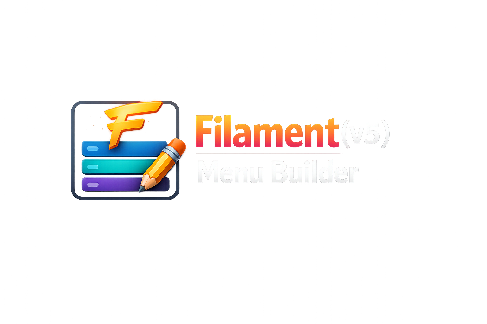

<p align="centre">
  
</p>

<h1 align="centre">Filament(v5) Menu Builder</h1>

<p align="centre">
  A powerful, hierarchical menu builder for <strong>Filament v5</strong> with drag-and-drop reordering, icon support, and tenant-aware architecture.
</p>

<p align="centre">
  <a href="#features">Features</a> •
  <a href="#requirements">Requirements</a> •
  <a href="#installation">Installation</a> •
  <a href="#usage">Usage</a> •
  <a href="#configuration">Configuration</a>
</p>

---

## ✨ Features

- **🌳 Hierarchical Menus** — Create unlimited parent/child menu levels
- **🔄 Smart Reordering** — Up/down arrows and automatic order conflict resolution
- **🎨 Icon Support** — Built-in Heroicon selector with emoji previews
- **🔗 Flexible Links** — Internal routes or external URLs with target control
- **🏢 Tenant-Aware** — Optional multi-tenant support via `stancl/tenancy`
- **⚡ Performance** — Optional caching for menu tree rendering
- **📱 Mobile-Ready** — Responsive Blade components for frontend rendering
- **🛡️ Auto-Correction** — Duplicate order detection automatically assigns next available position

---

## 📋 Requirements

| Requirement | Version |
|-------------|---------|
| PHP         | ^8.1 |
| Laravel     | ^10.0 \| ^11.0 \| ^12.0 |
| Filament    | ^5.0 |
| Database    | MySQL, PostgreSQL, SQLite, or SQL Server |

**Optional Dependencies:**
- `stancl/tenancy` — for multi-tenant support
- `spatie/laravel-permission` — for role-based menu access (via Filament Shield)

---

## 🚀 Installation

```bash
composer require vendor/filament-menu-builder
```

### 1. Publish the configuration

```bash
php artisan vendor:publish --tag=filament-menu-builder-config
```

### 2. Publish and run migrations

```bash
php artisan vendor:publish --tag=filament-menu-builder-migrations
php artisan migrate
```

### 3. Publish views (optional)

```bash
php artisan vendor:publish --tag=filament-menu-builder-views
```

### 4. Register the resource (if not auto-discovered)

Add to your `AdminPanelProvider`:

```php
use Vendor\FilamentMenuBuilder\Resources\MenuResource;

public function panel(Panel $panel): Panel
{
    return $panel
        // ...
        ->resources([
            MenuResource::class,
            // ...
        ]);
}
```

---

## 📖 Usage

### Admin Panel

Navigate to **Menus** in your Filament admin panel at `/admin/menus`.

#### Creating Menus

1. Click **Create Menu**
2. Enter menu name
3. Select parent (optional) for hierarchical structure
4. Set order number (auto-corrects on conflict)
5. Choose an icon from the selector
6. Set URL (internal `/path` or external `https://...`)
7. Toggle active status

#### Reordering

- Use **↑** and **↓** arrows in the table to move items
- Reordering automatically shifts conflicting items
- Duplicate orders are auto-corrected on save

### Frontend Rendering

#### Blade Component

```blade
{{-- Render all root menus --}}
<x-filament-menu-builder::menu />

{{-- Render specific parent menu --}}
<x-filament-menu-builder::menu :parent="$parentMenu" />

{{-- With custom styling --}}
<x-filament-menu-builder::menu class="main-nav" />
```

#### Manual Rendering

```blade
@php
$menus = \Vendor\FilamentMenuBuilder\Models\Menu::getTree();
@endphp

@include('filament-menu-builder::components.menu', [
    'menus' => $menus
])
```

#### Eloquent Queries

```php
// Get all active menus as tree
$menuTree = \Vendor\FilamentMenuBuilder\Models\Menu::getTree();

// Get root menus only
$rootMenus = \Vendor\FilamentMenuBuilder\Models\Menu::root()->active()->get();

// Get children of specific parent
$submenus = \Vendor\FilamentMenuBuilder\Models\Menu::where('parent_id', $parentId)->get();

// Get menu with depth calculation
$menu = \Vendor\FilamentMenuBuilder\Models\Menu::find(1);
$depth = $menu->calculateDepth(); // Number of ancestors
```

---

## ⚙️ Configuration

Edit `config/filament-menu-builder.php`:

```php
return [
    // Model class used for menus
    'model' => \Vendor\FilamentMenuBuilder\Models\Menu::class,
    
    // Database table name
    'table_name' => 'menus',
    
    // Enable multi-tenant mode
    'tenant_aware' => false,
    
    // Enable menu tree caching
    'cache_enabled' => true,
    
    // Cache duration in seconds
    'cache_duration' => 3600,
];
```

### Tenant-Aware Setup

Enable `tenant_aware` in config, then add to your tenant migration:

```php
Schema::create('menus', function (Blueprint $table) {
    $table->id();
    $table->foreignId('tenant_id')->constrained(); // Add tenant relation
    $table->foreignId('parent_id')->nullable()->constrained('menus');
    $table->string('name');
    $table->string('url')->nullable();
    $table->string('target', 20)->nullable();
    $table->string('icon')->nullable();
    $table->integer('order')->default(0);
    $table->boolean('is_active')->default(true);
    $table->boolean('is_external')->default(false);
    $table->timestamps();
});
```

---

## 🏗️ Database Schema

| Column | Type | Description |
|--------|------|-------------|
| `id` | bigint | Primary key |
| `parent_id` | bigint nullable | Foreign key to parent menu |
| `name` | string | Menu item label |
| `url` | string nullable | Link URL or route |
| `target` | string nullable | Link target (`_blank`, etc.) |
| `icon` | string nullable | Heroicon name |
| `order` | integer | Sort position within parent |
| `is_active` | boolean | Visibility toggle |
| `is_external` | boolean | External link flag |

---

## 🎨 Customisation

### Custom Icons

Override the icon options in your service provider:

```php
use Vendor\FilamentMenuBuilder\Resources\MenuResource;

MenuResource::setIcons([
    'custom-icon' => 'Custom Label',
    'heroicon-o-star' => 'Star',
]);
```

### Custom Blade Views

Publish views and modify:

```bash
php artisan vendor:publish --tag=filament-menu-builder-views
```

Edit `resources/views/vendor/filament-menu-builder/components/menu.blade.php`

---

## 🧪 Testing

```bash
composer test
```

---

## 🤝 Contributing

Contributions welcome! Please see [CONTRIBUTING.md](CONTRIBUTING.md) for details.

---

## 📄 Licence

**GNU Affero General Public Licence v3.0 (AGPL-3.0)**

If you use this software in a network service (SaaS), you must provide source code to users. See [LICENCE](LICENCE) for details.

Commercial licensing available upon request — contact the copyright holder for details.

---

<p align="centre">
  Built with ❤️ for the Filament community
</p>
